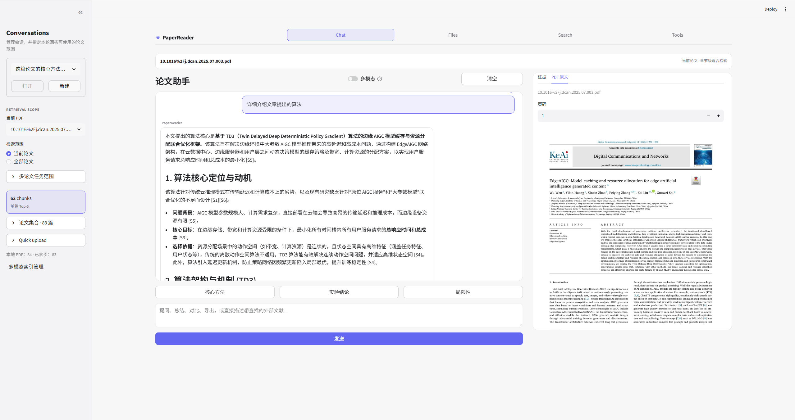
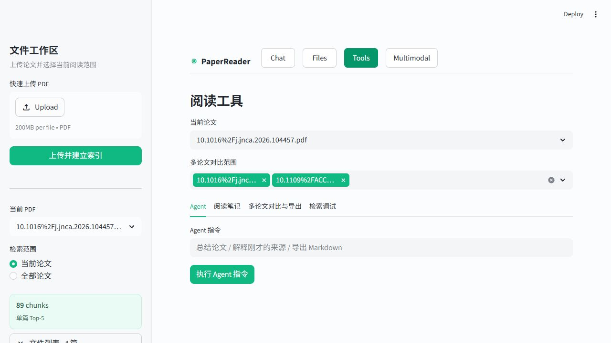
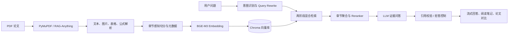

# PaperReader-RAG：多模态科研论文阅读 Agent

面向科研论文阅读与文献整理的本地 RAG 应用。系统支持 PDF 解析、基于证据的问答、结构化阅读笔记、多篇论文对比与结果导出；可按需接入 RAG-Anything，解析论文中的文本、图像、表格和公式。

> 核心技术：Python · FastAPI · Streamlit · Chroma · BGE-M3 · RAG-Anything · OpenAI-compatible LLM API

## 项目展示

| 论文问答与 PDF 对照 | 阅读工具与多论文工作流 |
| :---: | :---: |
|  |  |

## 架构



## Benchmark 结果

在 Open RAG Benchmark 的 100 条查询、200 篇论文语料上进行 A/B 评测：

| 指标 | Hybrid Baseline | 当前检索链路 | 变化 |
| --- | ---: | ---: | ---: |
| Section Recall@5 | 78.00% | **97.00%** | +19.00 pp |
| Section MRR | 0.6395 | **0.8433** | +31.9% |
| P50 检索延迟 | 4.15 s | 2.26 s | -45.5% |

两阶段检索的轻量版本可将 P50 检索延迟降至 **0.86 s**（较基线降低约 79%）。在 100 条生成式问答评测中，回答正确率为 **91%**，引用存在率和引用编号合法率均为 **100%**。详细实验配置与指标说明见 [Benchmark 说明](docs/benchmark_results.md)。

## 快速启动

```powershell
git clone https://github.com/sanchuanmingyue/RAG.git
cd RAG
python -m venv .venv
.\.venv\Scripts\Activate.ps1
pip install -r requirements.txt
Copy-Item .env.example .env
streamlit run app.py
```

在 `.env` 中填写 LLM 与 Embedding 的 API Key、Base URL 和模型名称后，访问 `http://localhost:8501`。如需使用 API 服务，可执行：

```powershell
uvicorn api.main:app --host 127.0.0.1 --port 8000 --reload
```

## 功能

- 上传一篇或多篇 PDF 论文
- 使用 PyMuPDF 按页解析文本
- 将文本切成 chunk，并保留 `paper_id`、`file_name`、`page`、`chunk_id`
- 使用 OpenAI-compatible API 生成 embedding 和回答
- 使用 Chroma 作为本地向量数据库
- 问答时返回引用页码和检索片段
- 生成论文阅读笔记：研究背景、研究问题、核心方法、创新点、实验设置、实验结果、优点、缺点、可改进方向
- Agent Router 自动识别问答、总结、对比、来源解释和导出意图
- Memory 保存当前论文、选中的多篇论文、历史问题、最近来源和已生成阅读卡片
- 多篇论文对比：先生成单篇阅读卡片，再基于卡片生成 Markdown 对比表
- 支持将最近结果、来源片段、阅读卡片和会话记录导出为 Markdown 或 JSON
- Evaluator 支持空来源拒答，并可通过 `RETRIEVAL_MAX_DISTANCE` 配置检索距离阈值
- 提供检索调试页面，可观察 chunk、metadata、Top-K 与相似度距离

## 项目结构

```text
.
├── app.py
├── api/
│   ├── main.py
│   └── schemas.py
├── pages/
│   └── 1_向量数据库学习.py
├── requirements.txt
├── .env.example
├── docs/
│   └── rag_vector_database.md
├── data/
│   └── papers/
├── storage/
│   ├── exports/
│   └── vector_db/
└── backend/
    ├── agent.py
    ├── config.py
    ├── evaluator.py
    ├── exporter.py
    ├── pdf_loader.py
    ├── text_splitter.py
    ├── embeddings.py
    ├── memory.py
    ├── vector_store.py
    ├── rag_chain.py
    ├── prompts.py
    ├── router.py
    ├── schemas.py
    ├── services.py
    ├── tools.py
    ├── summarizer.py
    └── paper_compare.py
```

## 配置与运行

在 `.env` 中配置：

```text
LLM_API_KEY
LLM_BASE_URL
LLM_MODEL
EMBEDDING_API_KEY
EMBEDDING_BASE_URL
EMBEDDING_MODEL
```

生成模型支持按顺序自动切换的阿里云模型池。所有模型复用同一个 DashScope API Key 和
OpenAI 兼容地址，模型 ID 通过模型服务控制台配置：

```text
LLM_API_KEY=你的阿里云百炼_API_Key
LLM_BASE_URL=https://dashscope.aliyuncs.com/compatible-mode/v1
LLM_MODELS=第一个模型ID,第二个模型ID,第三个模型ID
LLM_QUOTA_COOLDOWN_SECONDS=86400
LLM_FAILOVER_COOLDOWN_SECONDS=60
```

系统遇到额度耗尽、限流、模型不存在或服务端临时故障时，会依次尝试下一个模型。额度耗尽的
模型默认在当前服务进程中冷却一天，避免每次请求都重复失败；重启服务会清除冷却状态。
`LLM_MODELS` 未配置时仍兼容原来的单模型 `LLM_MODEL`。

生成模型与向量模型可以使用不同服务商。例如 GLM 走阿里云、BGE-M3 走硅基流动：

```text
LLM_BASE_URL=https://dashscope.aliyuncs.com/compatible-mode/v1
LLM_MODEL=glm-5.2
EMBEDDING_BASE_URL=https://api.siliconflow.cn/v1
EMBEDDING_MODEL=BAAI/bge-m3
VISION_BASE_URL=https://api.siliconflow.cn/v1
RAG_ANYTHING_VISION_MODEL=Qwen/Qwen3-VL-8B-Instruct
```

两者的 Key 分别写入 `LLM_API_KEY` 和 `EMBEDDING_API_KEY`，不要互换。更换 embedding 模型时必须使用
新的 Chroma collection 并重新索引，不能复用其他模型生成的向量。
当视觉与 embedding 使用相同的硅基流动地址时，系统会自动让视觉模型复用 `EMBEDDING_API_KEY`；
无需再维护第二个硅基流动 Key。
MinerU pipeline 负责论文页面的 OCR、版面、公式与表格结构提取；
`Qwen/Qwen3-VL-8B-Instruct` 负责图表语义描述并生成 RAG-Anything 所需的结构化结果，
通用文本问答仍使用上面的阿里云 `LLM_MODELS` 模型池。

启动 FastAPI（推荐的服务入口）：

```powershell
uvicorn api.main:app --host 127.0.0.1 --port 8000 --reload
```

启动后访问：

- Swagger：`http://127.0.0.1:8000/docs`
- OpenAPI：`http://127.0.0.1:8000/openapi.json`
- 健康检查：`http://127.0.0.1:8000/api/v1/health`

Streamlit 现在是可选的交互界面，和 FastAPI 共用 `backend/services.py`，可独立启动：

```powershell
streamlit run app.py
```

主界面采用“固定文件侧边栏 + 双栏阅读区”：左侧上传、选择论文和切换检索范围，主区域左栏进行
流式论文问答、右栏按页预览 PDF 原文；顶部 `Chat / Files / Tools / Multimodal` 作为主导航，
`Files` 集中管理本地文件和索引状态，`Tools` 保留 Agent、阅读笔记、
多论文对比及导出。PDF 预览采用逐页渲染，大文件不会在首屏一次性传入浏览器。

论文问答页使用流式生成，并在完成后展示最终引用校验结果、章节路径、页码、模型、拒答原因以及
检索/生成耗时。单篇论文自动返回 Top-5 章节，选择“全部论文”时自动扩大到 Top-10；仍可通过 API
中的 `top_k` 显式覆盖。`QA_MAX_TOKENS=600` 仅限制普通论文问答，不限制阅读笔记和多论文对比。

多模态页面采用按需初始化：打开页面时只检测依赖、GPU 和已有索引，点击“检查解析器”或正式解析时
才加载 RAG-Anything。`RAG_ANYTHING_DEVICE=auto` 会在 CUDA 可用时选择 GPU；也可以显式设为
`cuda` 或 `cpu`。首次加载 RAG-Anything/LightRAG 可能需要约一分钟，后续在同一 Streamlit 进程中复用。
4 GB 显存设备建议先勾选页码范围，仅解析 5～10 页验证流程。
Windows 环境会自动让 MinerU 的 localhost 健康检查绕过系统代理，同时保留外网代理用于模型下载。
4 GB GPU 默认使用 `RAG_ANYTHING_BACKEND=pipeline`；首次使用前可运行
`mineru-models-download -s modelscope -m pipeline` 预下载版面模型，避免首次解析时等待。

## FastAPI 接口

主要接口如下：

- `POST /api/v1/papers/index`：上传一个或多个 PDF，立即返回后台任务 ID。
- `GET /api/v1/tasks/{task_id}`：查询 PDF 解析、切分、embedding 和写库进度。
- `GET /api/v1/papers`：列出已索引论文。
- `POST /api/v1/retrieve`：只执行检索，返回分阶段时延。
- `POST /api/v1/chat`：执行检索增强问答。
- `POST /api/v1/chat/stream`：以 SSE 流式返回 `meta`、`delta`、`done`/`error` 事件。
- `POST /api/v1/summaries`：生成单篇论文阅读卡片。
- `POST /api/v1/agent`：按 `session_id` 保存独立的 Agent 记忆。
- `DELETE /api/v1/sessions/{session_id}`：清除对应会话记忆。

上传并轮询任务：

```powershell
curl.exe -X POST "http://127.0.0.1:8000/api/v1/papers/index" `
  -F "files=@E:\papers\example.pdf"

curl.exe "http://127.0.0.1:8000/api/v1/tasks/返回的task_id"
```

检索和问答：

```powershell
curl.exe -X POST "http://127.0.0.1:8000/api/v1/retrieve" `
  -H "Content-Type: application/json" `
  -d '{"question":"论文的核心方法是什么？","top_k":5,"retrieval_mode":"hybrid"}'

curl.exe -X POST "http://127.0.0.1:8000/api/v1/chat" `
  -H "Content-Type: application/json" `
  -d '{"question":"论文的主要实验结论是什么？","top_k":5}'

# -N 禁用 curl 输出缓冲，可直接观察逐段生成结果。
curl.exe -N -X POST "http://127.0.0.1:8000/api/v1/chat/stream" `
  -H "Content-Type: application/json" `
  -H "Accept: text/event-stream" `
  -d '{"question":"论文的主要实验结论是什么？","top_k":5}'
```

后台任务和 Agent 会话目前保存在单个 API 进程内。开发环境请保持一个 Uvicorn worker；部署为多 worker
或多机器时，应把任务状态、会话记忆迁移到 Redis，并使用 Celery/RQ 等外部任务队列。公开部署前还应增加鉴权。

## 使用方式

1. 在 `Chat` 左侧上传 PDF，或进入 `Files` 批量上传、补建索引。
2. 观察 PDF 解析、章节切分、向量生成和写库进度。
3. 在中间问答区输入问题，答案会流式显示；在右侧用页码跳转对照 PDF 原文。
4. 查看最终答案、引用章节、页码、拒答原因、模型和分阶段耗时。
5. 进入 `Tools` 生成阅读笔记、多论文对比或导出结果。
6. 在“Agent 工作台”中输入“总结这篇论文”“比较选中的论文”“解释刚才的来源”“导出 Markdown”等指令。
7. 在左侧选择多篇论文后，进入“多论文对比与导出”生成对比表或导出结果。
8. 打开检索调试页面，查看 Chroma 中的 chunk、元数据和排序结果。

## Agent 架构

本项目在原有 RAG 链路上新增了轻量 Agent 层：

```text
用户输入
  -> backend/router.py 判断意图
  -> backend/tools.py 调用问答、总结、对比、来源解释或导出工具
  -> backend/evaluator.py 检查 sources 和拒答条件
  -> backend/memory.py 更新当前论文、阅读卡片、最近来源和会话历史
  -> Streamlit 展示答案、来源和导出路径
```

核心入口是 `backend/agent.py` 中的 `ResearchAgent`。它不是复杂的自主规划 Agent，而是面向论文阅读场景的可控工具调度器，优先保证结果可解释、可追溯。

## Open RAG Benchmark 离线评测

项目提供了独立的离线评测入口，不会使用默认的 `paper_reader_chunks` collection，也不会把
基准数据混入 `data/papers`。它先评测检索；只有显式传入 `--run-generation` 时才会为每个问题
调用聊天模型生成回答。

1. 从 [Open RAG Benchmark 数据集](https://huggingface.co/datasets/vectara/open_ragbench) 下载数据到
   `data/benchmarks/open_ragbench`。下载目录中应包含 `official/pdf/arxiv/queries.json`、
   `qrels.json`、`answers.json` 和 `corpus/`。
2. 运行 100 条纯文本题的 baseline：

```powershell
python scripts\run_open_rag_bench.py `
  --dataset-root data\benchmarks\open_ragbench `
  --collection open_ragbench_hybrid_top5 `
  --run-name hybrid_top5 `
  --rebuild
```

结果会写入 `storage/evals/`，包含逐题检索记录和聚合指标：`Doc Recall@k`、`Section Recall@k`、
`Doc/Section MRR`、P50/P95 检索延迟，以及启用生成时的引用出现率、引用合法率与拒答率。
拒答会进一步区分 `no_sources`（无来源）、`model_refusal`（模型主动拒答）和
`missing_citation`（模型作答但漏写引用，被严格引用规则拦截）。越界引用在仍有合法来源时会自动删除
错误编号并保留答案；没有任何合法引用时才以 `invalid_citation` 拒答。生成评测直接复用第一次检索结果，
不会再为同一题重复检索。答案正确性采用分级判定：Yes/No 先比较中英文极性；数字、公式和专有
名词题做标准化精确比较；普通开放题使用当前多语言 embedding 模型计算余弦相似度；相似度在
`0.60`～`0.75` 的临界题再交给评审模型。评审默认复用 `LLM_MODELS`，也可通过
`ANSWER_JUDGE_MODELS` 指定单独的阿里云模型池。报告会记录判定阶段、理由、评审模型和原始输出。
报告还使用多语言 embedding 估算逐断言引用支持，输出 `claim_citation_precision`、
`claim_citation_recall` 和 `unsupported_claim_rate`；这是语义支持代理指标，不等同于严格逻辑蕴含。
低额度下可先按完整题集确定同一批语料，再只生成前几题；报告还会记录引用是否命中标准文档/章节、
实际使用的模型以及模型池切换次数：

```powershell
python scripts\run_open_rag_bench.py `
  --dataset-root data\benchmarks\open_ragbench `
  --collection open_ragbench_section_index_v2 `
  --max-cases 100 --max-documents 200 --generation-max-cases 5 `
  --top-k 5 --retrieval-mode hybrid --run-generation `
  --run-name citation_generation_smoke
```

用相同的 `--max-cases`、`--seed` 与 collection 重建方式，分别运行 `--retrieval-mode vector`、
`hybrid` 和不同 `--top-k`，再比较 JSON 报告。首轮不要启用 `--include-multimodal`；主应用是文本
RAG，而图表/图像题应留给 RAG-Anything 工作流。该数据集为 CC BY-NC 4.0，仅可用于非商业场景。

默认 `--max-documents 200` 会保留本次题集对应的全部标准论文，再以固定随机种子抽取干扰论文，
避免小规模试验为 1,000 篇文档生成 embedding。设置 `--max-documents 0` 才会索引完整 benchmark；
对比不同检索配置时必须固定 `--max-cases`、`--max-documents` 和 `--seed`。

## 当前检索优化与复测

默认检索链路已启用两阶段检索：先从 50 个候选 chunk 聚合出 Top-5 论文，再只在这些论文内取 50 个
候选 chunk，按 `section_path`/benchmark section 聚合向量分数、查询内归一化的关键词分数和词项覆盖度，
最终返回 Top-5 章节。References/Bibliography 默认降权；问题明确询问参考文献或引用时不降权。
评测 JSON 会额外写入 embedding、Chroma、关键词索引、论文阶段、章节阶段、聚合与父段扩展耗时。

Open RAG Benchmark 重建索引时会从 corpus Markdown 的真实标题生成 `section_title`、`section_path` 和
`section_type`，不再使用 `Benchmark section N` 作为主要章节标签。相关参数为
`ENABLE_TWO_STAGE_RETRIEVAL`、`DOCUMENT_CANDIDATE_K`、`DOCUMENT_TOP_K`、
`SECTION_CANDIDATE_K`、`SECTION_SUPPORT_CHUNKS` 与 `REFERENCE_SECTION_PENALTY`。

每次索引还会建立同名的 `<collection>_sections` collection。章节向量直接取该章节所有 chunk 向量的
质心，因此不产生额外 embedding API 调用；短小的 Abstract、Conclusion、Datasets 等章节也能独立参与
召回。聚合后的前 20 个章节默认通过硅基流动 `POST /v1/rerank` 和免费模型
`BAAI/bge-reranker-v2-m3` 重排，复用 embedding 的硅基流动 API Key；请求失败时自动退回原排序。
将 `RERANKER_PROVIDER=local` 即可切换回保留的本地 `BAAI/bge-reranker-base` 实现。

两阶段中的关键词原始分数只计算一次，第二阶段从进程内 LRU 缓存中过滤候选论文。FastAPI lifespan 和
Streamlit 的缓存服务初始化时会预建关键词倒排索引，把原先约 7.5 秒的首次查询冷启动移到服务启动阶段。
API reranker 预热只检查配置，不发请求、不消耗额度；仅当切换到本地 provider 且设置
`PRELOAD_CROSS_ENCODER=true` 时才会在启动阶段加载本地模型。

`EMBEDDING_SECTION_CONTEXT=true` 会在**新建或重建索引**时把论文名和 `section_path` 一并送入 embedding
模型，但展示给用户和 LLM 的原始 chunk 文本不会改变。因此，已有论文库需要在方便时重新“解析并建立索引”
才会获得这一项向量层面的章节收益；不需要重建也可立即获得缓存、标题加分和章节去重的收益。

要和已有 `hybrid_top5` 结果做可复现的 A/B，请使用新 collection（避免覆盖旧基准）并保持题数、文档数与
随机种子一致：

```powershell
python scripts\run_open_rag_bench.py `
  --dataset-root data\benchmarks\open_ragbench `
  --collection open_ragbench_section_index_v2 `
  --run-name section_index_v2 `
  --max-cases 100 --max-documents 200 --seed 42 --rebuild
```

该命令会为 benchmark 语料调用 embedding API；首次运行后可去掉 `--rebuild`，用于只测查询阶段。
评测启动前会执行预热，因此查询时延不再混入关键词索引构建和模型首次加载耗时。

## 文献阅读验收测试

`scripts/run_literature_bench.py` 提供三组小规模验收测试，复用现有两阶段检索、章节聚合、生成引用、
正确性评分与声明级引用评分，不以构建研究级排行榜为目标。

QASPER 30 题用于检查单篇论文阅读能力，报告 `Evidence Recall@5`、`Answer Correctness`、
`Faithfulness`、有效引用率和端到端延迟。QASPER 默认使用 Top-5，并用更宽的临界区间
（0.40～0.78）把跨语言或低相似度答案交给评审模型，最终正确阈值为 0.65：

```powershell
python scripts/run_literature_bench.py --suite qasper --max-cases 30 --rebuild
```

QASPER 无答案 15 题仅报告 `Correct Refusal Rate` 和 `False Answer Rate`：

```powershell
python scripts/run_literature_bench.py --suite qasper-unanswerable --max-cases 15 --rebuild
```

ScholarQA-Multi 默认抽取 10 题并返回 Top-10。每道题只在其自带的多篇候选论文片段中检索，
报告答案正确性、引用 Faithfulness、多来源回答率和延迟：

```powershell
python scripts/run_literature_bench.py --suite scholarqa-multi --max-cases 10 --rebuild
```

第一次运行使用 `--rebuild` 建立各自独立的 Chroma collection；使用相同题数和 seed 复测时可去掉该参数。
生成模块会按问题语言作答：中文问题生成中文答案，英文问题生成英文答案；无依据时也使用相同语言拒答。
结果统一写入 `storage/evals`。QASPER 默认读取 `data/QASPER/qasper-dev-v0.3.json`，
ScholarQA-Multi 默认读取 `data/ScholarQABench/data/scholarqa_multi/human_answers.json`。
